# React Task Tracker

## FEAT

- [x] CREATE TASK
- [x] READ TASKS
- [x] UPDATE TASK
- [x] CHECKED TASK
- [x] DELETE TASK
- [x] GROUP BY COMPLETED TASKS
- [x] TIMESTAMP
- [x] LOCALSTORAGE

## Preview

### UI

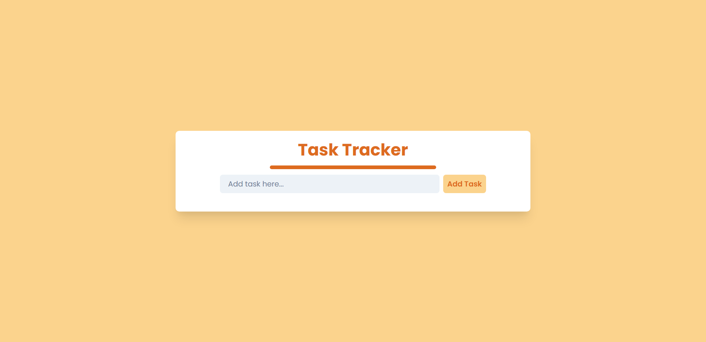

### CREATE

#### Validation

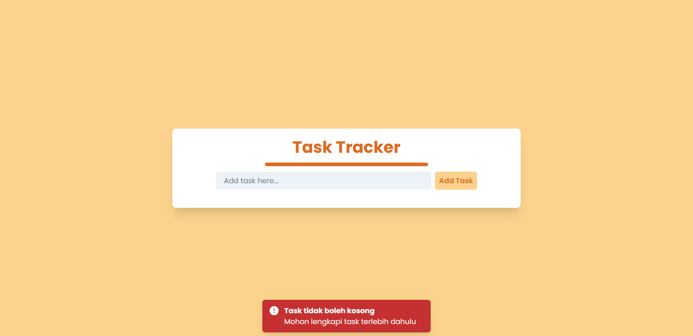

#### Create Task

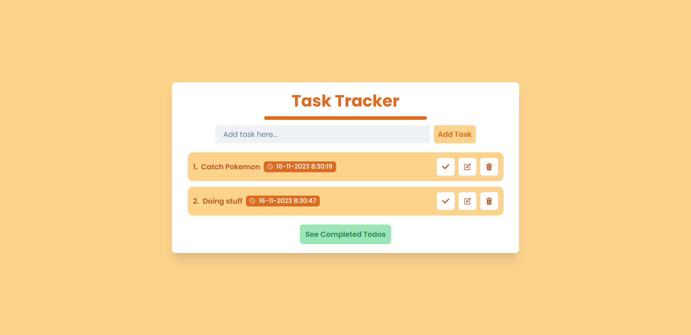

#### Local Storage

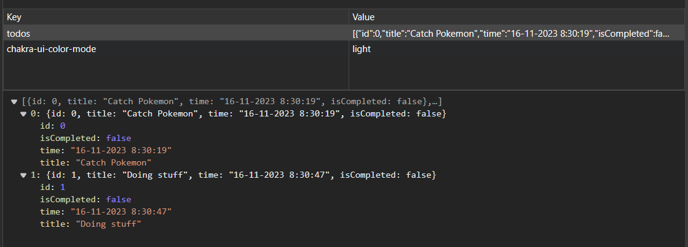

### READ


### DELETE

#### Confirmation

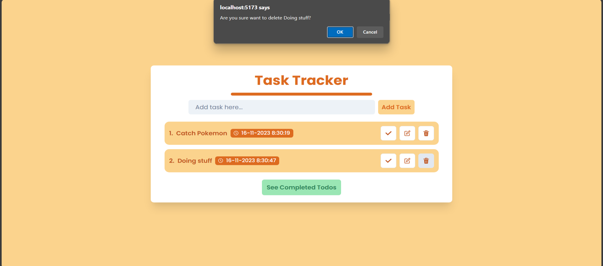

#### Toast onSuccess

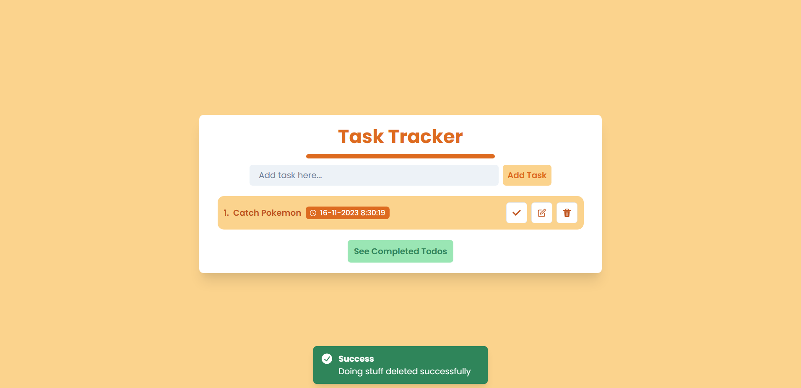

#### Local Storage

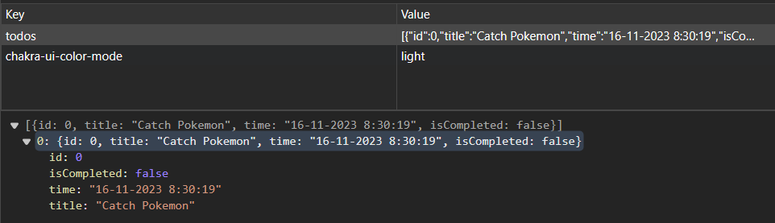

### CHECKED COMPLETED TASK

#### UNCHECKED TASK

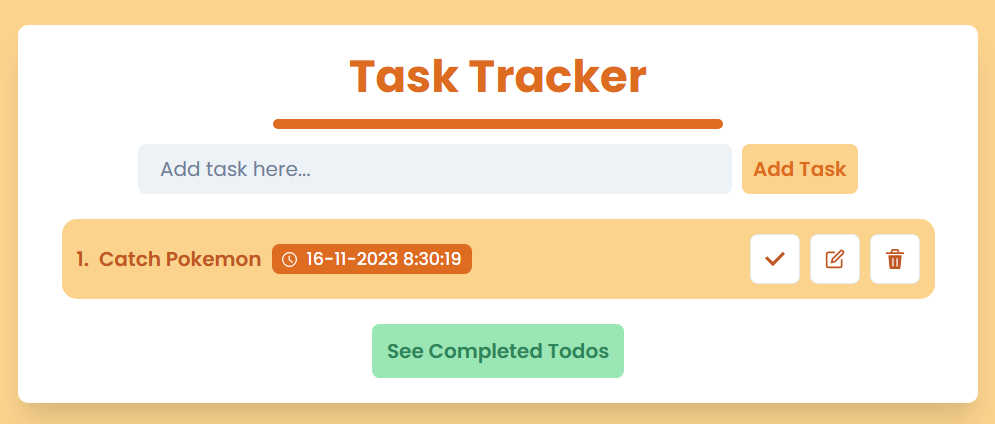

#### CHECKED TASK

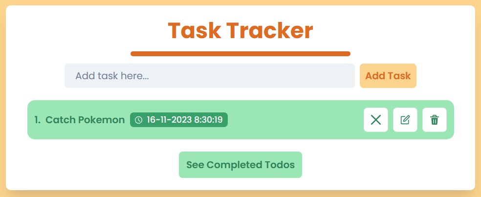

#### LOCAL STORAGE

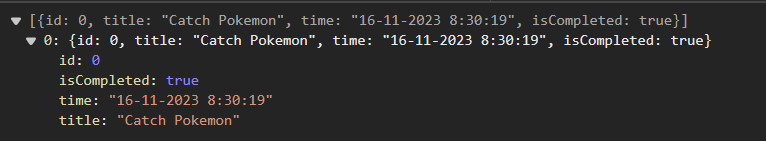

### GROUP BY COMPLETED TASKS

#### SEE ALL TASK

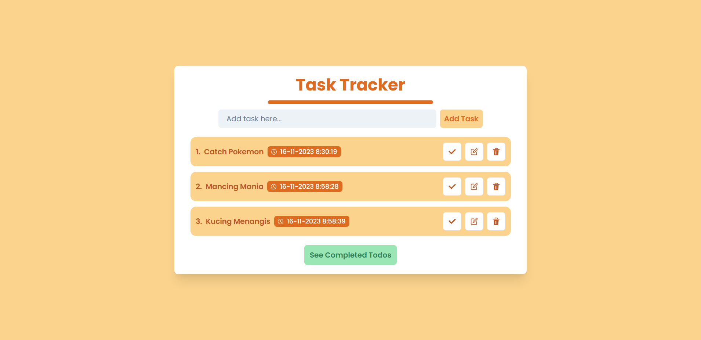

#### SEE NULL COMPLETED TASKS

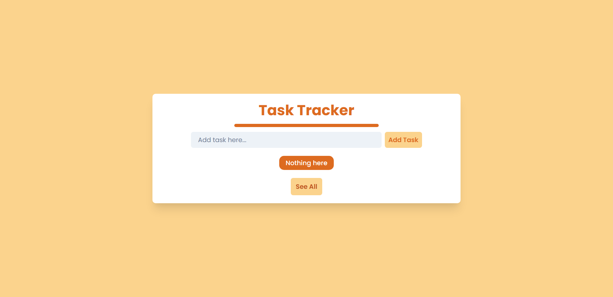

#### SEE COMPLETED TASKS

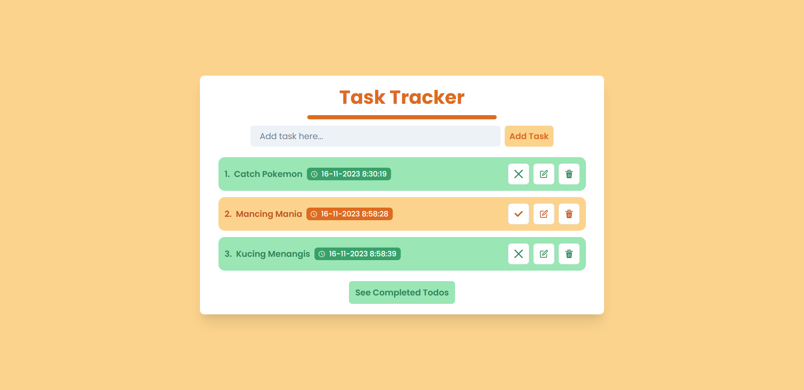
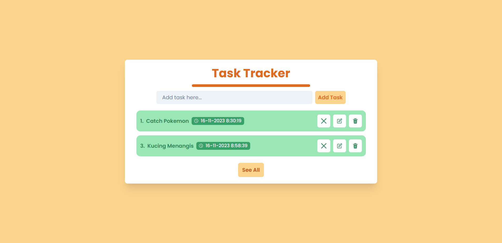

### UPDATE TASK

#### PROMPT

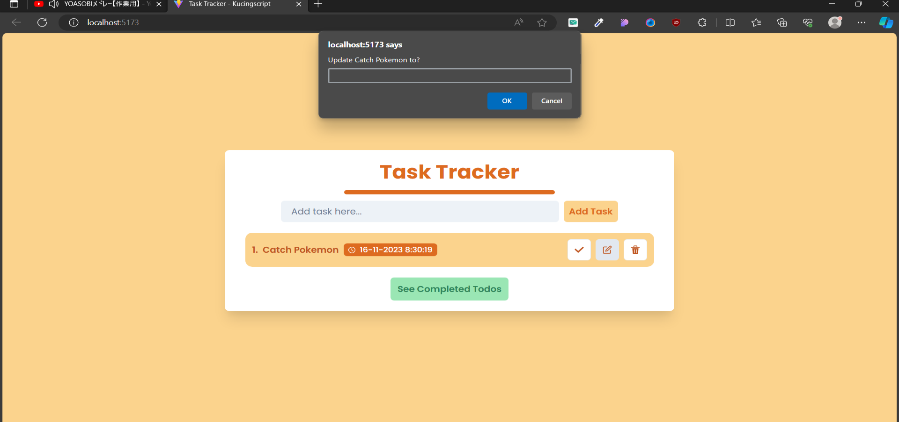

#### VALIDATION

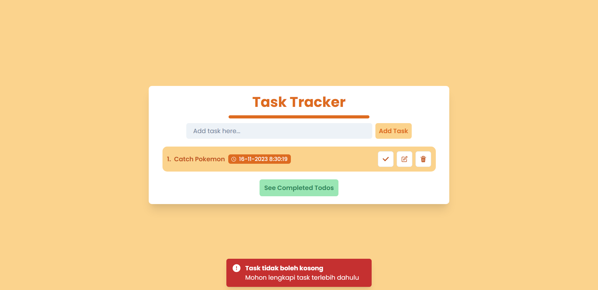

#### Toast onSuccess

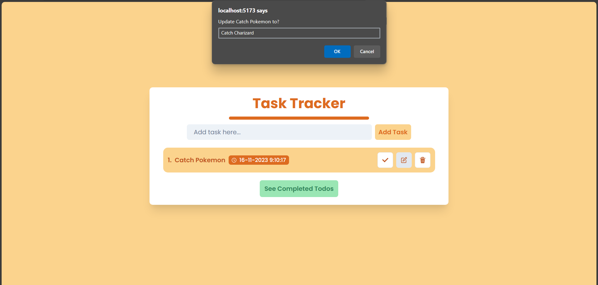
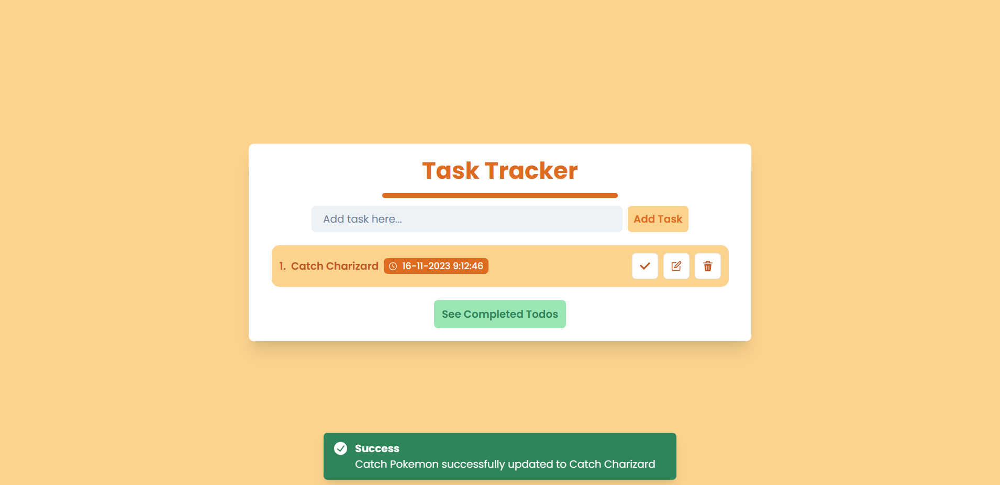

#### Local Storage

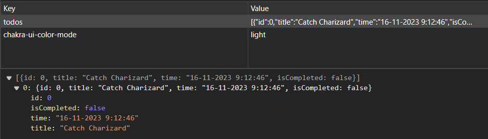

# HOW TO RUN TASK TRACKER?

```
cd client
yarn
yarn run dev
```

## React + Vite

This template provides a minimal setup to get React working in Vite with HMR and some ESLint rules.

Currently, two official plugins are available:

- [@vitejs/plugin-react](https://github.com/vitejs/vite-plugin-react/blob/main/packages/plugin-react/README.md) uses [Babel](https://babeljs.io/) for Fast Refresh
- [@vitejs/plugin-react-swc](https://github.com/vitejs/vite-plugin-react-swc) uses [SWC](https://swc.rs/) for Fast Refresh
